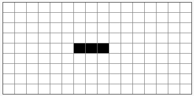

# Exercice 1 - Le jeu de la vie, v1 : un clignotant

Commençons par une petite "séance cinoche" :

https://www.youtube.com/watch?v=S-W0NX97DB0

Le challenge consiste à créer et faire évoluer un "clignotant", comme montré à cet endroit de la vidéo : https://youtu.be/S-W0NX97DB0?t=185 ([Télécharger](https://github.com/pworontzoff/playground-AnimPaper-Life-Enonces/blob/master/markdowns/videos/animEx1.mp4?raw=true))

Pour cela, nous allons coder les règles d'évolutions du jeu de la vie :
- une case noire devient blanche uniquement si celle-ci est entourée de moins de 2 ou de plus de 3 voisines ;
- une case blanche devient noire uniquement si celle-ci est entourée d'exactement 3 voisines ;

Une "génération" consiste à appliquer ces règles pour chaque cellule.

Le jeu de la vie consiste à enchaîner les générations.

Le configuration (ou génération) initiale étant celle du clignotant :

Pour cet exercice, on peut se limiter à 10 étapes (10 générations), afin d'obsever le clignotant en action. On pourra également travailler avec une grille de 9x16 cases de 25 pixels, avec un délai d'animation de 0,5s.

## Quelques remarques

Pour que le jeu de la vie fonctionne bien, il faut prendre en compte les nombre de voisins lors d'une  génération et décider du sort de chaque case (naissance ou mort) sur base de ces nombres !

Par exemple, avec le clignotant, on doit prendre en compte uniquement les nombres de voisines suivants :

le jeu :  
0 0 0 0 0 0 0  
0 0 0 0 0 0 0  
0 0 X X X 0 0  
0 0 0 0 0 0 0  
0 0 0 0 0 0 0  

les nombres de voisines sur base desquels on prend les décisions :  
0 0 0 0 0 0 0  
0 1 2 3 2 1 0  
0 0 1 2 1 0 0  
0 1 2 3 2 1 0  
0 0 0 0 0 0 0  

Bon travail !

@[Exercice 2]({"stubs": ["main.c"],"command": "sh /project/target/run.sh", "project" : "exercices"})
