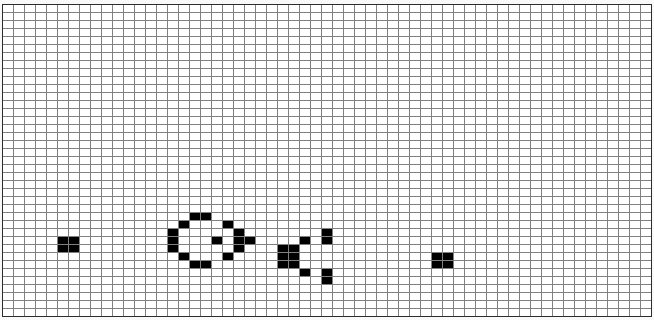

# Exercice 2 - Le jeu de la vie, v2 : un canon à planeurs

Le challenge consiste à créer et faire évoluer un "canon à planeurs", comme montré à cet endroit de la vidéo : https://youtu.be/S-W0NX97DB0?t=484 ([Télécharger](https://github.com/pworontzoff/playground-AnimPaper-Life-Enonce/blob/master/markdowns/videos/animEx2.mp4?raw=true))

Pour cela, nous allons programmer (sur une grille de 40x60 cases de 10 pixels, avec un délai d'animation de 0,05s) la configuration initiale suivante :

## Remarques

Lorsqu'un planeur touche le bord, le programme du vidéaste utilise une grille de calcul plus grande que la grille de visualisation, ce qui empêche une modification dans les changements sur les planeurs, de sorte qu'ils continuent au delà de la grille (de visualisation) plutôt que de devenir un carré stable qui va se faire percuter par le planeur suivant, détruisant ce planeur et le carré en quelques générations.

Dans notre cas, nous obtiendrons donc (contrairement à l'animation de la vidéo) des "carrés stables" lorsque les planeurs touchent les bords.

Bon travail !

@[Exercice 2]({"stubs": ["main.c"],"command": "sh /project/target/run.sh", "project" : "exercices"})
