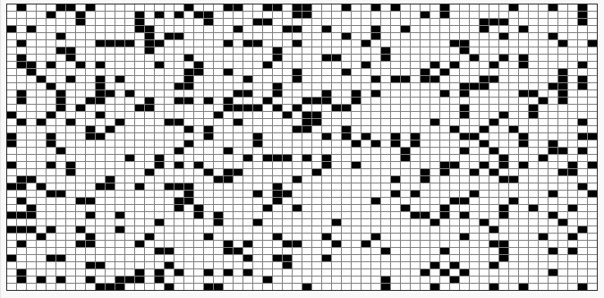

# Exercice 3 - Le jeu de la vie, v3 : configuration aléatoire

Le challenge consiste à créer et créer une configuration initiale aléatoire de manière à (peut-être) découvrir de nouvelles structures stables ou oscillantes du jeu de la vie, comme montré à cet endroit de la vidéo : https://youtu.be/S-W0NX97DB0?t=226

Pour cela, nous allons programmer (sur une grille de 40x60 cases de 10 pixels, avec un délai d'animation de 0,05s) une configuration initiale aléatoire, par exemple :

Ensuite, bien entendu, nous ne priverons pas de lancer la simulation ;-)

## Remarques

Dans l'exemple aléatoire donné plus haut, on a environ une cellule sur 5 (1 carré noir pour 4 blancs), c'est programmé... Vous devrez donc pouvoir contrôler la proportion de cellules dans votre solution !

Bon travail !

@[Exercice 3]({"stubs": ["main.c"],"command": "sh /project/target/run.sh", "project" : "vie3"})
